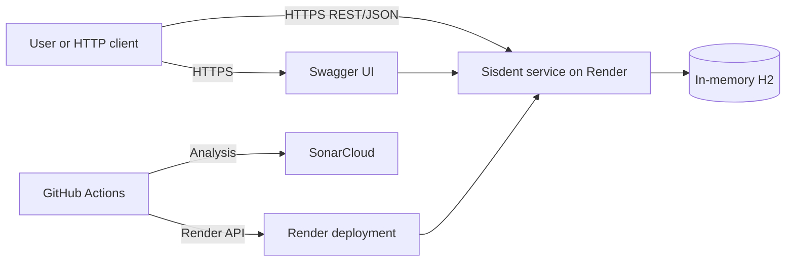
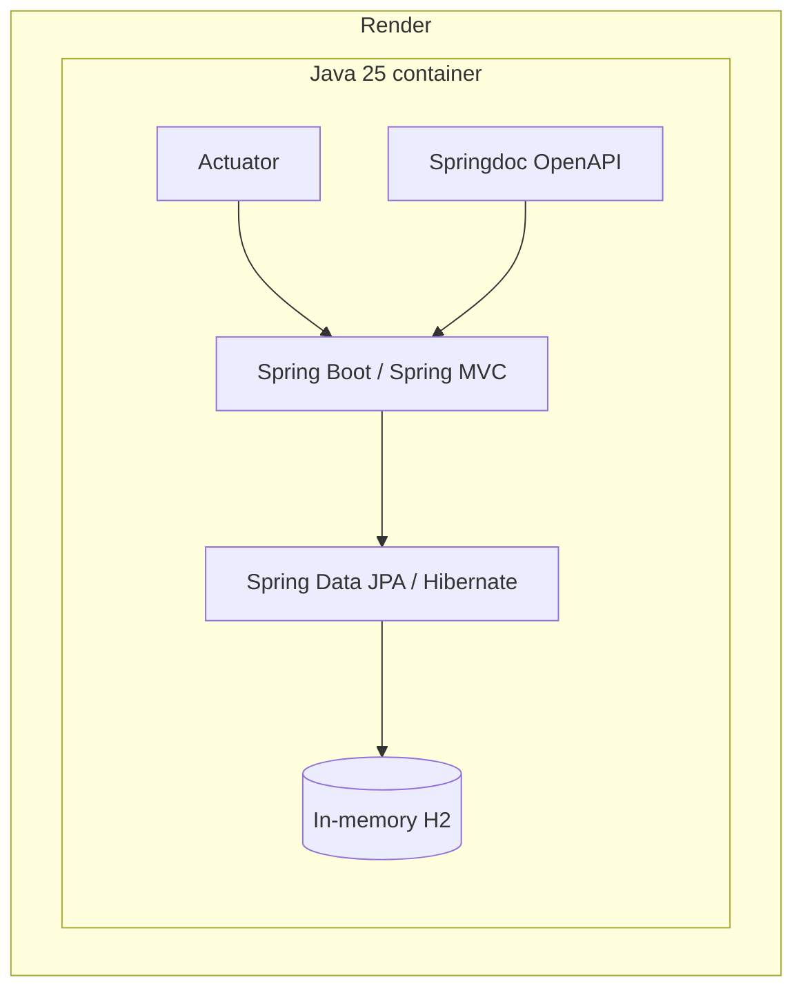
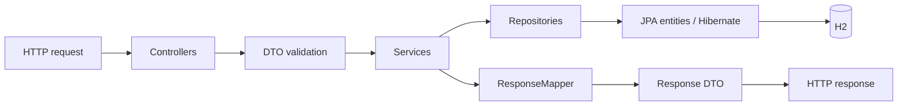
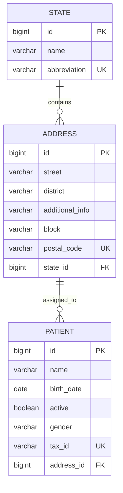
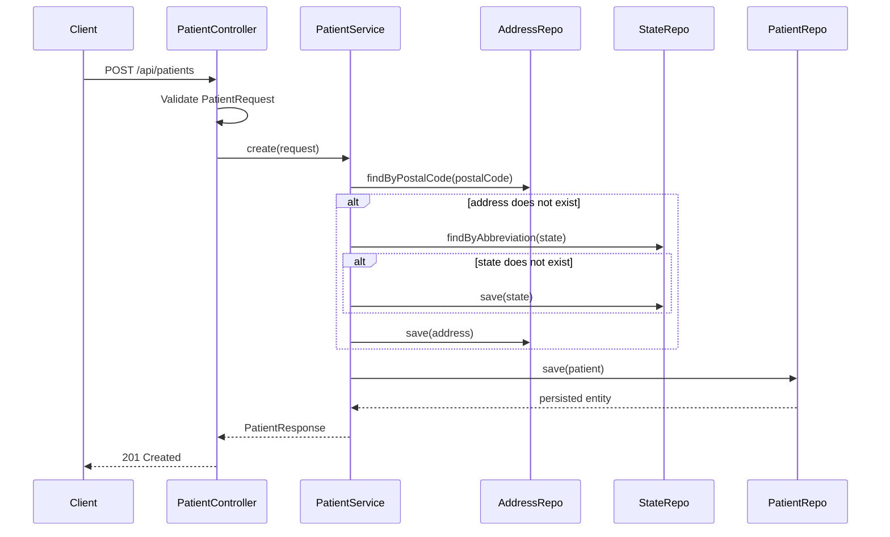
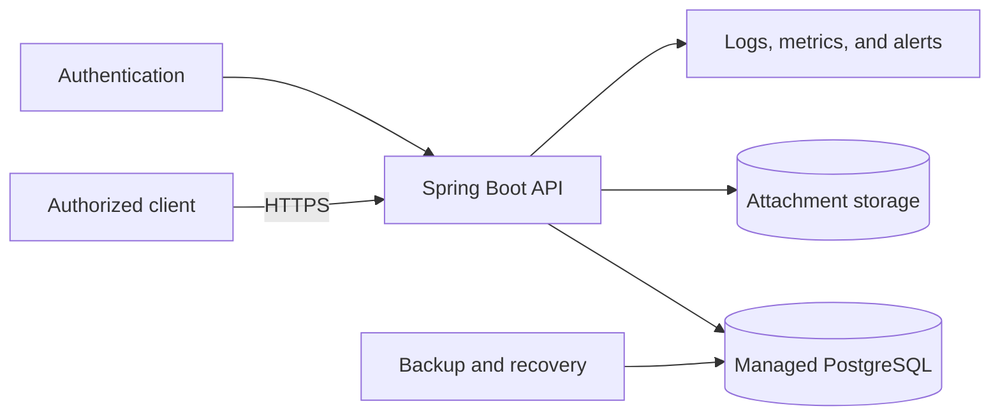

# Sisdent architecture

## Scope and context

Sisdent is currently a small modular monolith packaged as one Spring Boot JAR
and deployed as one Render container. HTTP clients access a REST API, and data
is stored in an H2 database embedded in the application process.

This document describes the implemented architecture. Future elements are
explicitly identified as recommendations.

## System context

There is currently no external database, queue, cache, separate frontend, or
identity provider.

## Runtime container

The final image uses `eclipse-temurin:25-jre`, non-root user `1001`, port 8080,
and `-XX:MaxRAMPercentage=75.0`. The effective port comes from Render's `PORT`
environment variable.

## Internal components

### Controllers

Adapt HTTP requests to application calls. They define routes, `201` and `404`
responses, and `@Valid` boundaries. They never access repositories directly.

### DTOs

Immutable records separate HTTP contracts from persistence entities. Request
records contain input validation; response records represent the graph needed
by API clients.

### Services

Define transaction boundaries and application rules. Queries use
`@Transactional(readOnly = true)`, while patient creation runs as one write
transaction. Address identity is currently based on postal code, and state
identity is based on abbreviation.

### Repositories

Spring Data JPA interfaces. `@EntityGraph` loads address and state relationships
for response mapping while `open-in-view=false`, also reducing N+1 queries.

### Mapper and configuration

`ResponseMapper` converts entities into API DTOs. `InitialDataLoader` seeds JSON
data transactionally only when the database is empty. `OpenApiConfiguration`
defines API title, version, and description.

## Data model

Current cardinalities:

- A state has zero or more addresses.
- An address can be assigned to multiple patients.
- Every patient has exactly one address.
- Every address has exactly one state.

No JPA cascade is configured. The service coordinates creation explicitly.

## Main flow: create patient

The entire operation runs in one transaction. A uniqueness violation or other
failure rolls it back.

## Data initialization and lifecycle

1. Spring Boot starts, and Hibernate creates the tables.
2. `InitialDataLoader` checks all three entity counts.
3. If any data exists, the complete seed process is skipped.
4. Otherwise, states, addresses, and patients are loaded from JSON in that
   order.
5. On shutdown, `create-drop` removes the schema. The cycle starts again on the
   next process start.

This is suitable for a demonstration but incompatible with durable data.

## Architecture qualities

### Strengths

- Clear separation between transport, application, and persistence concerns.
- DTOs isolate API contracts from JPA entities.
- Declarative transactions and read-only queries.
- `open-in-view=false` makes persistence access explicit.
- Entity graphs control association loading.
- Input validation at the HTTP boundary.
- Unit and integration tests with coverage above the current gate.
- Multi-stage container image running as a non-root user.
- Deployment gated by tests, SonarCloud, and health verification.

### Limitations and risks

- In-memory H2 loses changes after restarts and deployments.
- `create-drop` is unsafe for real data.
- There is no authentication or authorization.
- Tax IDs and other personal data are returned in full.
- There is no audit history, backup, or recovery strategy.
- List endpoints have no pagination.
- Concurrent `find-or-create` calls may race. Constraints prevent duplicates,
  but conflict responses are not handled cleanly.
- Domain errors do not have a standardized representation.
- The core dental domain has not been modeled yet.

## Recorded architecture decisions

### Modular monolith

A single deployment is appropriate for the current size. Microservices would
add operational cost without proportional benefit. Prefer domain-oriented
modules inside the monolith before separating processes.

### DTOs separate from entities

This protects the HTTP contract from JPA changes and prevents accidental proxy
or relationship serialization.

### In-memory database for the initial delivery

H2 minimized setup and enabled a free demonstration. It is a temporary choice,
not a production persistence foundation.

### GitHub-controlled deployment

Render auto deploy is disabled. GitHub Actions submits only commits that pass
the Quality Gate and waits for deployment plus health confirmation. See
`docs/PIPELINE.md`.

## Recommended target architecture

The first evolution should retain the monolith:

Recommended sequence:

1. External PostgreSQL with Flyway or Liquibase migrations.
2. `local`, `test`, and `prod` profiles; H2 only for development and tests.
3. Spring Security and role-based access control.
4. Problem Details and stable application error codes.
5. Pagination, filtering, conflict handling, locking, and auditing.
6. Observability, backups, and restoration testing.
7. Scheduling, practitioners, and clinical-record modules, keeping domain
   boundaries inside the monolith until there is a measurable reason to split.

## Constraints for future agents

- Never assume that current Render data is persistent.
- Never add secrets to the repository.
- Do not weaken the Quality Gate merely to make a build pass; fix the cause or
  obtain an explicit owner decision.
- Do not enable Render auto deploy without redesigning the pipeline.
- Never expose the H2 console publicly.
- Before introducing real clinical data, treat security, privacy, retention,
  and auditing as architecture requirements rather than optional improvements.

