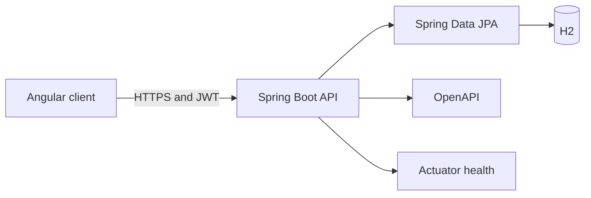
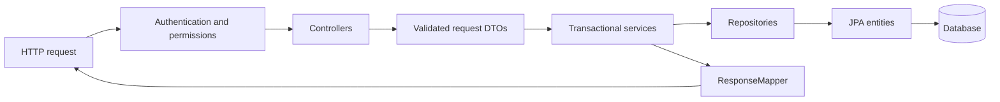
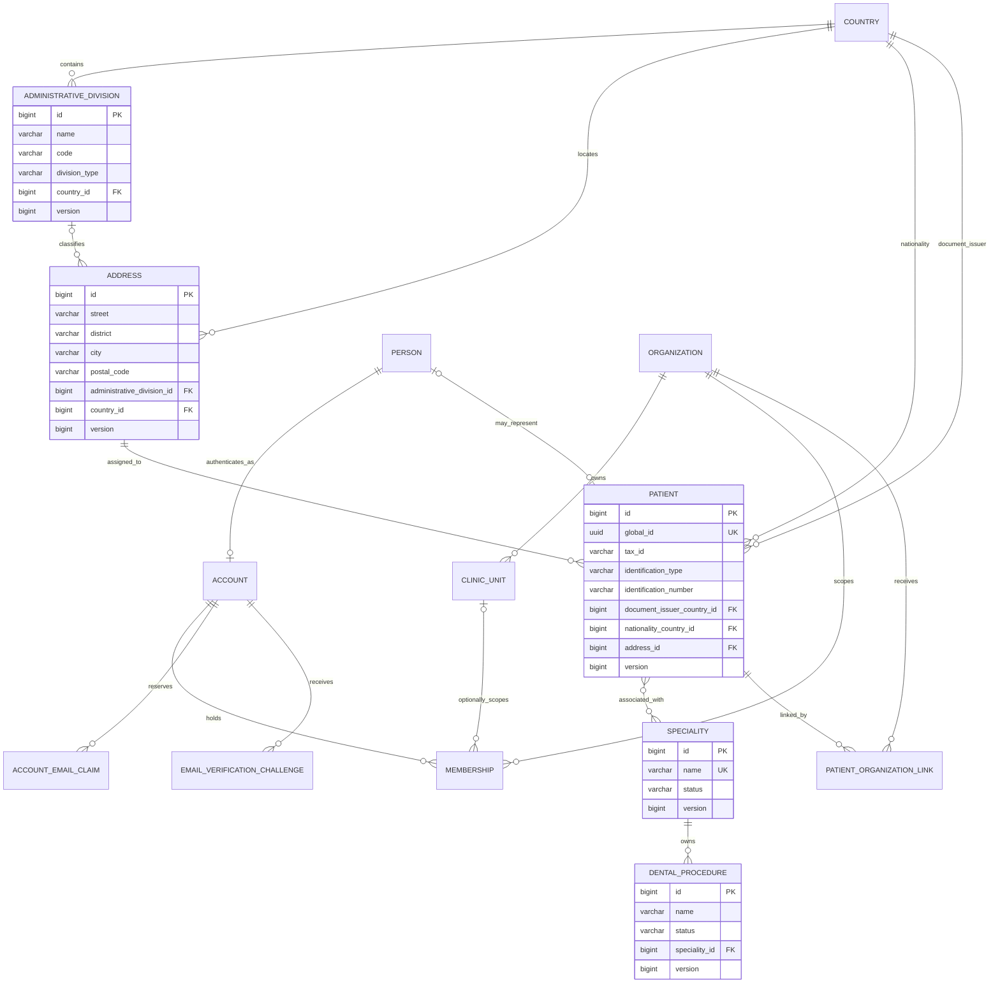
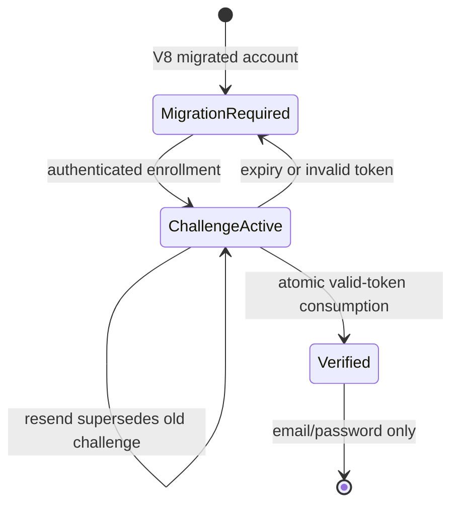

# Sisdent architecture

## Scope

Sisdent is a modular monolith composed of a Spring Boot REST API and an Angular
web application. It is currently an MVP for dental administration and global
account/tenant foundations. Scoped clinical records and odontograms are
implemented; patient portal access and billing are not.

The present domain foundation is international. Portugal and other European
countries are supported alongside the existing demonstration data. Language,
address, and identity rules must therefore not assume a Brazilian or US format.

## Runtime

```mermaid
flowchart LR
    Browser[Angular client] -->|HTTPS and JWT| API[Spring Boot API]
    API --> JPA[Spring Data JPA]
    JPA --> DB[(H2)]
    API --> DOC[OpenAPI]
    API --> HEALTH[Actuator health]
```

The backend is packaged with the compiled frontend in one Java 25 container.
Authentication is local and stateless through signed JWTs. H2 remains suitable
for development and pre-production demonstration only; a managed PostgreSQL
database is the intended production target.

## Internal structure

```mermaid
flowchart LR
    HTTP[HTTP request] --> SEC[Authentication and permissions]
    SEC --> C[Controllers]
    C --> DTO[Validated request DTOs]
    DTO --> S[Transactional services]
    S --> R[Repositories]
    R --> E[JPA entities]
    E --> DB[(Database)]
    S --> M[ResponseMapper]
    M --> HTTP
```

- Controllers adapt HTTP contracts and do not access repositories directly.
- DTO records isolate the API from persistence entities.
- Services own transaction boundaries and application rules.
- Repositories execute database-backed filtering, sorting, and pagination.
- `ResponseMapper` maps initialized entity graphs to response DTOs while
  `open-in-view=false`.
- Flyway is the sole schema evolution mechanism; applied migrations are
  immutable.

## Foundational domain model

```mermaid
erDiagram
    COUNTRY ||--o{ ADMINISTRATIVE_DIVISION : contains
    COUNTRY ||--o{ ADDRESS : locates
    ADMINISTRATIVE_DIVISION o|--o{ ADDRESS : classifies
    COUNTRY ||--o{ PATIENT : nationality
    COUNTRY ||--o{ PATIENT : document_issuer
    ADDRESS ||--o{ PATIENT : assigned_to
    PATIENT }o--o{ SPECIALITY : associated_with
    SPECIALITY ||--o{ DENTAL_PROCEDURE : owns
    PERSON ||--o| ACCOUNT : authenticates_as
    PERSON o|--o| PATIENT : may_represent
    ACCOUNT ||--o{ MEMBERSHIP : holds
    ACCOUNT ||--o{ ACCOUNT_EMAIL_CLAIM : reserves
    ACCOUNT ||--o{ EMAIL_VERIFICATION_CHALLENGE : receives
    ORGANIZATION ||--o{ CLINIC_UNIT : owns
    ORGANIZATION ||--o{ MEMBERSHIP : scopes
    CLINIC_UNIT o|--o{ MEMBERSHIP : optionally_scopes
    PATIENT ||--o{ PATIENT_ORGANIZATION_LINK : linked_by
    ORGANIZATION ||--o{ PATIENT_ORGANIZATION_LINK : receives

    PATIENT {
        bigint id PK
        uuid global_id UK
        varchar tax_id
        varchar identification_type
        varchar identification_number
        bigint document_issuer_country_id FK
        bigint nationality_country_id FK
        bigint address_id FK
        bigint version
    }
    ADDRESS {
        bigint id PK
        varchar street
        varchar district
        varchar city
        varchar postal_code
        bigint administrative_division_id FK
        bigint country_id FK
        bigint version
    }
    ADMINISTRATIVE_DIVISION {
        bigint id PK
        varchar name
        varchar code
        varchar division_type
        bigint country_id FK
        bigint version
    }
    SPECIALITY {
        bigint id PK
        varchar name UK
        varchar status
        bigint version
    }
    DENTAL_PROCEDURE {
        bigint id PK
        varchar name
        varchar status
        bigint speciality_id FK
        bigint version
    }
```

Every core entity contains `created_at`, `created_by`, `updated_at`,
`updated_by`, and an optimistic-lock `version`.

### Identity and tenancy rules

- A patient has a stable, platform-global UUID independent of database IDs.
- A document is identified by document type, issuing country, and normalized
  number. Supported MVP types are `PASSPORT` and `NATIONAL_ID_CARD`.
- Tax ID is optional and is not used as a global identity key.
- Verified accounts authenticate with one normalized, globally unique email
  address. Canonical email claims prevent a pending enrollment address from
  colliding with either another pending address or an authoritative address.
- Account, person, and patient are separate so a future patient login does not
  need administrative impersonation.
- A compatibility link retains identification/password login only while the
  migrated account has `email_migration_required=true`.
- Membership roles are scoped to an organization or clinic unit. Revoking one
  membership preserves the account and every unrelated membership.
- Platform administration is separate and grants no patient access.

### Address rules

- Country uses ISO 3166-1 alpha-2 codes.
- Administrative division identity is scoped by country and code.
- Administrative division, district, and postal code are optional.
- City and street are required.
- Postal codes are not globally unique and are not restricted to eight digits.
- Patient creation creates its own address record; a postal code never implies
  that two patients share the same address.
- Postal lookup is country-scoped and may return multiple matches.

### Catalog lifecycle

Platform specialities own dental procedures. Records are deactivated rather
than physically deleted, preserving references and audit history. Removing a
procedure from a speciality update marks it inactive. Inactive specialities
cannot be newly assigned to patients.

The future organization model will layer organization-owned custom procedures
over the platform catalog, with availability, price, and duration configured
per clinic unit.

## Compatibility and migrations

Flyway migrations V6 and V7 upgrade existing data without dropping patient
records:

- `states` becomes `administrative_divisions`;
- `procedures` becomes `dental_procedures`;
- legacy patient documents become `NATIONAL_ID_CARD` issued by the backfilled
  country;
- existing patients receive global UUIDs;
- legacy audit metadata is backfilled;
- state permissions are renamed to administrative-division permissions.

V8 creates persons, global accounts, organizations, clinic units, scoped
memberships, and patient-organization links. It maps every legacy user to a
unique synthetic email without removing the legacy credential and assigns
existing patients to explicit `LEGACY_MIGRATION` links.

V9 adds explicit email-verification state, a separately stored pending email,
canonical email claims, and auditable verification challenges. Existing
non-migrating bootstrap accounts are backfilled as verified. Migrated accounts
retain their synthetic email and legacy login until their own verification
succeeds.

`/api/states` remains a temporary backend alias for
`/api/administrative-divisions`. New clients use only the new route.

## Verified-email enrollment

```mermaid
stateDiagram-v2
    [*] --> MigrationRequired: V8 migrated account
    MigrationRequired --> ChallengeActive: authenticated enrollment
    ChallengeActive --> ChallengeActive: resend supersedes old challenge
    ChallengeActive --> MigrationRequired: expiry or invalid token
    ChallengeActive --> Verified: atomic valid-token consumption
    Verified --> [*]: email/password only
```

The raw 256-bit challenge secret exists only while being passed to the delivery
interface. Persistence stores its SHA-256 hash, target email, expiry,
consumption/revocation state, provider metadata, and normal audit fields.
Successful verification promotes the pending email, marks it verified, clears
the pending claim, retires legacy login, consumes the token, and invalidates
other active challenges in one transaction.

The default/production delivery implementation fails closed until a real
provider is configured. Explicit `development`, `test`, and `e2e` profiles may
use an in-memory provider. Only `e2e` exposes an authenticated, current-account
test-support seam; that controller cannot be instantiated in production.

JWTs include `emailMigrationRequired`. Every authenticated request compares
that claim with current account state. A pre-verification token is rejected
after cutover, so the user must start a fresh verified-email session.

## Identity-management evolution

`Account` is the canonical global authentication identity and `Person` is its
display identity. Memberships are the sole source of organization and clinic
access. The Phase 1 `app_users` record remains a temporary, audited
compatibility link for accounts that still require verified-email enrollment;
it is not the primary administrative identity and must not be used to grant
tenant or clinical authority.

Phase 6 consolidates the administrative UI and APIs around Account, Person,
and Membership while retaining legacy records read-only until a future,
explicitly approved retirement phase. Platform administrators use paged global
account management; organization administrators use organization-scoped account
and membership operations, with no evidence of access in other organizations.
The current-account response and Accounts and Access UI use only public UUIDs,
display names, authentication state, and authorized membership summaries.
The header's active membership selects an operational context. Accounts and
Access has a stricter, persisted account-management organization for delegated
administrators: changing the header never grants user-management visibility or
membership mutation outside that assigned organization. Only a platform
administrator may use the global account endpoints and view an unfiltered
account list.

## Security boundary

## Operational scheduling

Practitioners are organization-owned profiles with public UUIDs, optional
account association and logically deactivated lifecycle. Appointment reads and
writes are organization and optionally clinic-unit scoped; platform
administration confers no operational access. An appointment binds one active
organization patient link, one same-organization active practitioner, and one
same-organization clinic unit. Its lifecycle is `SCHEDULED` followed by one
terminal state: `CANCELLED`, `COMPLETED`, or `NO_SHOW`.

Scheduling stores UTC instants plus the validated IANA scheduling timezone.
Competing create/reschedule requests acquire a pessimistic lock on the
practitioner before checking interval overlap. This is portable to H2 and
PostgreSQL, though PostgreSQL may later gain an additional native exclusion
constraint. Performed procedures exist only under completed appointments,
snapshot catalog names, and are corrected only through audited logical voiding.

Patient repositories are reached through organization-scoped services. Name
search only traverses explicit patient-organization links. Exact intake
matching returns one boolean. Platform technical administration does not grant
clinical access. See `docs/PHASE_2_IMPLEMENTATION.md` for the authorization
matrix, migration strategy, and compatibility risks.

## Known limitations

- No cross-organization clinical sharing or temporary support-access workflow exists.
- No treatment-plan, billing, patient-portal, or cross-organization clinical
  sharing model exists.
- No digital signature, retention, export, anonymization, or legal-hold workflow exists.
- JWT revocation is not persisted.
- H2 is not the production persistence target.
- Auditing records the latest author and timestamps, not a complete immutable
  change-event history.

## Evolution order

1. Global account identity, memberships, scoped authorization, and patient links (implemented).
2. Verified-email enrollment and retirement of legacy identification login (implemented).
3. Practitioner, appointment, and performed-procedure model (implemented).
4. Protected clinical encounters and odontogram (implemented).
5. Account and access-management consolidation; legacy identity compatibility (implemented).
6. Treatment plans, unit pricing, acceptance, and billing.
7. Production persistence, attachment storage, email delivery, observability, backup, and
   recovery.
8. RGPD workflows validated with Portuguese and EU legal/compliance specialists.
