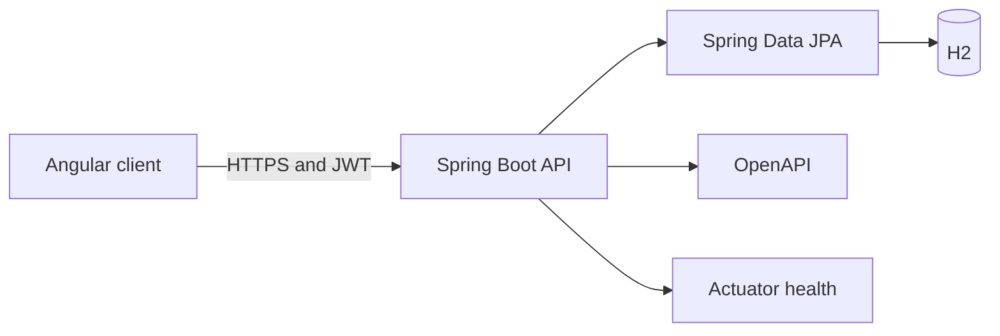
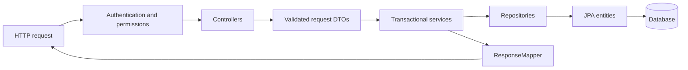
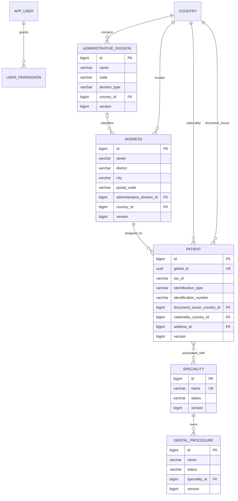

# Sisdent architecture

## Scope

Sisdent is a modular monolith composed of a Spring Boot REST API and an Angular
web application. It is currently an MVP for dental administration. Clinical
records, appointments, organizations, clinic units, patient portal access, and
billing are not implemented yet.

The present domain foundation is international. Portugal and other European
countries are supported alongside the existing demonstration data. Language,
address, and identity rules must therefore not assume a Brazilian or US format.

## Runtime

```mermaid
flowchart LR
    Browser[Angular client] -->|HTTPS and JWT| API[Spring Boot API]
    API --> JPA[Spring Data JPA]
    JPA --> DB[(H2)]
    API --> DOC[OpenAPI]
    API --> HEALTH[Actuator health]
```

The backend is packaged with the compiled frontend in one Java 25 container.
Authentication is local and stateless through signed JWTs. H2 remains suitable
for development and pre-production demonstration only; a managed PostgreSQL
database is the intended production target.

## Internal structure

```mermaid
flowchart LR
    HTTP[HTTP request] --> SEC[Authentication and permissions]
    SEC --> C[Controllers]
    C --> DTO[Validated request DTOs]
    DTO --> S[Transactional services]
    S --> R[Repositories]
    R --> E[JPA entities]
    E --> DB[(Database)]
    S --> M[ResponseMapper]
    M --> HTTP
```

- Controllers adapt HTTP contracts and do not access repositories directly.
- DTO records isolate the API from persistence entities.
- Services own transaction boundaries and application rules.
- Repositories execute database-backed filtering, sorting, and pagination.
- `ResponseMapper` maps initialized entity graphs to response DTOs while
  `open-in-view=false`.
- Flyway is the sole schema evolution mechanism; applied migrations are
  immutable.

## Foundational domain model

```mermaid
erDiagram
    COUNTRY ||--o{ ADMINISTRATIVE_DIVISION : contains
    COUNTRY ||--o{ ADDRESS : locates
    ADMINISTRATIVE_DIVISION o|--o{ ADDRESS : classifies
    COUNTRY ||--o{ PATIENT : nationality
    COUNTRY ||--o{ PATIENT : document_issuer
    ADDRESS ||--o{ PATIENT : assigned_to
    PATIENT }o--o{ SPECIALITY : associated_with
    SPECIALITY ||--o{ DENTAL_PROCEDURE : owns
    APP_USER ||--o{ USER_PERMISSION : grants

    PATIENT {
        bigint id PK
        uuid global_id UK
        varchar tax_id
        varchar identification_type
        varchar identification_number
        bigint document_issuer_country_id FK
        bigint nationality_country_id FK
        bigint address_id FK
        bigint version
    }
    ADDRESS {
        bigint id PK
        varchar street
        varchar district
        varchar city
        varchar postal_code
        bigint administrative_division_id FK
        bigint country_id FK
        bigint version
    }
    ADMINISTRATIVE_DIVISION {
        bigint id PK
        varchar name
        varchar code
        varchar division_type
        bigint country_id FK
        bigint version
    }
    SPECIALITY {
        bigint id PK
        varchar name UK
        varchar status
        bigint version
    }
    DENTAL_PROCEDURE {
        bigint id PK
        varchar name
        varchar status
        bigint speciality_id FK
        bigint version
    }
```

Every core entity contains `created_at`, `created_by`, `updated_at`,
`updated_by`, and an optimistic-lock `version`.

### Identity rules

- A patient has a stable, platform-global UUID independent of database IDs.
- A document is identified by document type, issuing country, and normalized
  number. Supported MVP types are `PASSPORT` and `NATIONAL_ID_CARD`.
- Tax ID is optional and is not used as a global identity key.
- User accounts still authenticate with the legacy identification-type flow.
  Global email authentication and separation of person, account, and
  organization memberships are deliberately deferred to the identity phase.

### Address rules

- Country uses ISO 3166-1 alpha-2 codes.
- Administrative division identity is scoped by country and code.
- Administrative division, district, and postal code are optional.
- City and street are required.
- Postal codes are not globally unique and are not restricted to eight digits.
- Patient creation creates its own address record; a postal code never implies
  that two patients share the same address.
- Postal lookup is country-scoped and may return multiple matches.

### Catalog lifecycle

Platform specialities own dental procedures. Records are deactivated rather
than physically deleted, preserving references and audit history. Removing a
procedure from a speciality update marks it inactive. Inactive specialities
cannot be newly assigned to patients.

The future organization model will layer organization-owned custom procedures
over the platform catalog, with availability, price, and duration configured
per clinic unit.

## Compatibility and migrations

Flyway migrations V6 and V7 upgrade existing data without dropping patient
records:

- `states` becomes `administrative_divisions`;
- `procedures` becomes `dental_procedures`;
- legacy patient documents become `NATIONAL_ID_CARD` issued by the backfilled
  country;
- existing patients receive global UUIDs;
- legacy audit metadata is backfilled;
- state permissions are renamed to administrative-division permissions.

`/api/states` remains a temporary backend alias for
`/api/administrative-divisions`. New clients use only the new route.

## Security boundary

Permissions currently apply by feature. Patients see no portal yet; the USER
role is a read-only staff role in this MVP. Platform technical administration
must not imply future access to clinical content. Organization-scoped roles,
patient self-access, temporary support access, and immutable access-event audit
belong to later phases.

## Known limitations

- No organization, clinic-unit, or cross-clinic consent model exists yet.
- No clinical note, odontogram, appointment, or performed-procedure model exists.
- No digital signature, retention, export, anonymization, or legal-hold workflow exists.
- JWT revocation is not persisted.
- H2 is not the production persistence target.
- Auditing records the latest author and timestamps, not a complete immutable
  change-event history.

## Evolution order

1. Global account identity and organization/clinic memberships.
2. Organization-scoped authorization and patient-clinic links.
3. Practitioner, appointment, and performed-procedure model.
4. Clinical records and odontogram.
5. Treatment plans, unit pricing, acceptance, and billing.
6. Production persistence, attachment storage, observability, backup, and
   recovery.
7. RGPD workflows validated with Portuguese and EU legal/compliance specialists.
