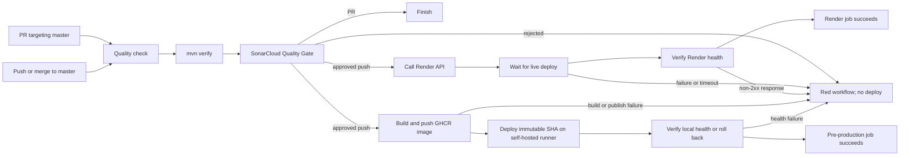

# CI, quality, and deployment pipeline

## Purpose

This document records how Sisdent automation currently works so that a new
developer or agent can maintain it without reconstructing previous decisions.

Related files:

- `.github/workflows/ci.yml`: GitHub Actions workflow.
- `pom.xml`: Maven build, tests, and JaCoCo configuration.
- `Dockerfile`: container image deployed to Render.
- `render.yaml`: Render service definition.

## Current workflow

The pipeline contains four separate jobs:

1. `Quality check` runs tests, produces coverage, submits the SonarCloud
   analysis, and waits for the Quality Gate.
2. `Build pre-production image` runs only for a trusted push to `master`. It
   builds the exact approved commit, publishes immutable and convenience tags
   to GHCR, and uploads the deployment bundle.
3. `Deploy to Render` runs only for a push to `master` and only after the
   quality job succeeds. It deploys the exact approved commit, waits for Render,
   and verifies application health.
4. `Deploy to local pre-production` runs on the dedicated self-hosted runner
   after the image build. It downloads no source checkout, pulls the immutable
   image, starts Compose, verifies health, and rolls back when possible.

Triggers:

- A pull request targeting `master` runs only the quality check.
- A push to `master`, including a merged pull request, runs quality checks and
  then deploys when they pass.



The Render and local pre-production jobs are independent after the Quality
Gate. An offline self-hosted runner does not prevent the Render job from
starting or completing.

## `Quality check` job

The job uses `ubuntu-latest` with the
`maven:3.9.16-eclipse-temurin-25` container, fixing Maven and Java 25 in CI.

Steps:

1. `actions/checkout@v6` checks out the full history with `fetch-depth: 0`,
   which Sonar needs for accurate SCM analysis.
2. `mvn --batch-mode --no-transfer-progress verify` compiles the application,
   runs all tests, and generates `target/site/jacoco/jacoco.xml`.
3. Maven Sonar Scanner submits the analysis to project `blnunes_sisdent` in
   organization `blnunes`.
4. `-Dsonar.qualitygate.wait=true` waits for SonarCloud. A rejected Quality Gate
   makes the command fail and prevents deployment.

The `contents: read` permission belongs only to this job because it is the only
job that checks out the repository. The deployment job performs no checkout,
avoiding duplicate work and following least privilege.

Coverage thresholds and severity rules are configured in SonarCloud, not in
the workflow YAML. On July 21, 2026, JaCoCo line coverage was 97.54%, and the
gate required at least 90%. Update this document if the external gate changes.

## `Deploy to Render` job

The job has three controls:

- `if: github.event_name == 'push'`: pull requests never deploy.
- `needs: quality-check`: tests and Sonar must pass first.
- `timeout-minutes: 25`: the workflow cannot wait indefinitely.

Flow:

1. Validate `RENDER_API_KEY` and `RENDER_SERVICE_ID`.
2. Call `POST /v1/services/{serviceId}/deploys` with `GITHUB_SHA`, ensuring
   Render deploys exactly the commit that passed quality checks.
3. Read the returned deploy ID and poll Render every 10 seconds.
4. Treat `live` as success. Fail immediately for `build_failed`,
   `update_failed`, `pre_deploy_failed`, `canceled`, or `deactivated`.
5. Request `https://sisdent-yhze.onrender.com/actuator/health`, with retries to
   allow for startup time on the free plan.

`render.yaml` deliberately uses `autoDeployTrigger: off`. Enabling Render auto
deploy as well would allow a push to create two deployments. GitHub Actions is
the single deployment orchestrator.

## Local pre-production jobs

The build job uses a GitHub-hosted runner and publishes two GHCR tags:

- `ghcr.io/blnunes/sisdent:<commit SHA>` is immutable and is the deployment
  input;
- `ghcr.io/blnunes/sisdent:preprod` is a convenience pointer and is never used
  as the authoritative rollback record.

The build job packages only `compose.preprod.yml`, the Caddy configuration, and
`deploy/preprod/deploy.sh`. The self-hosted job downloads that artifact directly
to `/srv/sisdent`; it does not run `actions/checkout` and keeps no source tree.

The self-hosted runner must have the standard `self-hosted`, `linux`, and `x64`
labels plus the custom `sisdent-preprod` label. Host bootstrap, network policy,
runtime files, rollback behavior, and registration steps are documented in
`docs/PREPROD.md`.

The workflow authenticates to GHCR with its short-lived `GITHUB_TOKEN`. No
long-lived registry token belongs on the Ubuntu host. The build job receives
`packages: write`; the deployment job receives `packages: read`.

## Required secrets

Repository secrets live under
`GitHub > Settings > Secrets and variables > Actions`.

| Secret | Source | Purpose |
| --- | --- | --- |
| `SONAR_TOKEN` | SonarCloud | Authenticate code analysis |
| `RENDER_API_KEY` | Render Account Settings > API Keys | Authenticate deployment API calls |
| `RENDER_SERVICE_ID` | Render service settings; value starts with `srv-` | Identify the Sisdent service |

Never store secret values in source files, logs, commits, or documentation.
GitHub can show a secret name and update date but cannot reveal its value.

## Diagnosing a failed pipeline

1. Open `GitHub > Actions > CI` and find the first failing step.
2. For `Unit tests`, reproduce with `./mvnw verify`.
3. If `SonarCloud` ends with `QUALITY GATE STATUS: FAILED`, inspect the Sonar
   dashboard. Intermediate warnings such as SLF4J messages are not necessarily
   the cause.
4. For `Trigger deploy`, verify both Render secrets and API-key permissions.
5. For `Wait for deploy`, inspect the corresponding Render deployment logs.
6. For `Verify application health`, inspect `/actuator/health`, `${PORT}`, and
   application startup logs.

Useful commands:

```bash
./mvnw verify
gh run list --branch master --limit 5
gh run view <RUN_ID> --log-failed
curl --fail https://sisdent-yhze.onrender.com/actuator/health
```

## Notifications

GitHub sends Actions notifications according to the account settings under
`GitHub > Settings > Notifications > Actions`. There is no separate email
integration in the workflow. Email notifications require a verified address
and enabled Actions notifications.

## Evolution guidelines

- Do not add checkout to the deployment job without a concrete need.
- Do not re-run the full Maven build during Sonar analysis when the existing
  JaCoCo output can be reused.
- Do not enable Render auto deploy while GitHub controls deployments.
- For staging and production, use GitHub Environments, environment-specific
  secrets, and separate Render service IDs.
- Before PostgreSQL deployment, introduce migrations and never use
  `ddl-auto=create-drop` in production.
