# CI, quality, and deployment pipeline

## Purpose

This document records how Sisdent automation currently works so that a new
developer or agent can maintain it without reconstructing previous decisions.

Related files:

- `.github/workflows/ci.yml`: production deployment and release tagging.
- `.github/workflows/preprod.yml`: local pre-production deployment.
- `.github/workflows/pr-quality.yml`: pull-request quality checks.
- `.github/workflows/rollback-production.yml`: manual production rollback.
- `pom.xml`: Maven build, tests, and JaCoCo configuration.
- `Dockerfile`: container image deployed to Render.
- `render.yaml`: Render service definition.

## Current workflow

The automation is split into independent workflows so production-only jobs do
not appear as skipped in pre-production runs:

1. `Quality check` runs tests, produces coverage, submits the SonarCloud
   analysis, and waits for the Quality Gate on `master`.
2. `Build pre-production image` runs only for a trusted push to
   `feat/preprod-deployment`. It builds the exact approved commit, publishes
   immutable and convenience tags to GHCR, and uploads the deployment bundle.
3. `Deploy to local pre-production` runs in the GitHub `preprod` environment on
   the dedicated self-hosted runner after the image build. It downloads no
   source checkout, pulls the immutable image, starts Compose, verifies health,
   and rolls back when possible.
4. `Deploy to Render` runs in the GitHub `production` environment only for a
   push to `master` and only after the quality job succeeds. It deploys the
   exact approved commit, waits for Render, and verifies application health.
5. `Tag deployed release` creates a SemVer tag only after the production health
   check succeeds.
6. `Rollback production` is a manual workflow that redeploys the immutable
   commit referenced by an existing release tag.

Triggers:

- `workflow_dispatch` on `CI` permits a manual quality run. Render deployment
  and release tagging still require a push to `master`.
- A pull request targeting `feat/preprod-deployment` runs the quality check.
- A push or merge to `feat/preprod-deployment` runs quality checks, builds the
  image, and deploys it to the local pre-production machine.
- A pull request targeting `master` runs the source-branch validation and the
  quality check.
- A push or merge to `master` runs quality checks and deploys to Render
  production. It does not deploy to the local pre-production machine.

```mermaid
flowchart LR
    F[Feature branch] --> PRP[PR to feat/preprod-deployment]
    PRP --> Q[Quality check]
    Q -->|approved merge| P[Push to preprod branch]
    P --> B[Build and push GHCR image]
    B --> L[Deploy immutable SHA locally]
    L --> H[Verify health or roll back]
    H --> T[Manual pre-production testing]
    T --> PRM[PR from preprod to master]
    PRM --> Q2[Quality check]
    Q2 --> M
    PRM --> M[Merge to master]
    M --> R[Deploy to Render production]
    R --> C[Verify production health]
    C --> G[Create release tag]
```



Pre-production and production are separate stages. Production promotion is a
reviewed merge from `feat/preprod-deployment` to `master`; a local deployment
does not automatically update Render.

## Branch protection and environments

Create GitHub environments named `preprod` and `production`. The workflow
associates local deployment with `preprod` and Render deployment with
`production`, allowing environment-specific approvals and secrets when needed.
Restrict the `preprod` environment to `feat/preprod-deployment` and the
`production` environment to `master`. Production may additionally require a
reviewer before the deployment job starts.

Configure repository branch rules as follows:

- For `feat/preprod-deployment`, block deletion and force pushes, require pull
  requests, and require the `Quality check` status check before merging.
- For `master`, block deletion and force pushes, require pull requests, and
  require the `Quality check` status check.
- Do not configure a required deployment on `master`: production deploys happen
  after merge, while the `Quality check` rejects normal production PRs whose
  source is not `feat/preprod-deployment`. The only other accepted shape is the
  strictly validated, `pom.xml`-only automatic version bump.
- Do not allow routine bypass of these rules. Promote production changes from
  `feat/preprod-deployment` after local validation.

These settings are configured under `Settings > Rules > Rulesets` or branch
protection in GitHub. Workflow YAML cannot make a branch undeletable by itself.

## `Quality check` job

The job uses `ubuntu-latest` with the
`maven:3.9.16-eclipse-temurin-25` container, fixing Maven and Java 25 in CI.

Steps:

1. `actions/checkout` pinned to the reviewed v6 commit checks out the full
   history with `fetch-depth: 0`, which Sonar needs for accurate SCM analysis.
2. `mvn --batch-mode --no-transfer-progress verify` compiles the application,
   runs all tests, and generates `target/site/jacoco/jacoco.xml`.
3. Maven Sonar Scanner submits the analysis to project `blnunes_sisdent` in
   organization `blnunes`.
4. `-Dsonar.qualitygate.wait=true` waits for SonarCloud. A rejected Quality Gate
   makes the command fail and prevents deployment.

The Maven property `sonar.exclusions` excludes `.github/workflows/**` from
SonarCloud analysis. GitHub Actions workflow files are validated by GitHub when
the workflows run and are intentionally outside the Java quality gate.

The `contents: read` permission belongs only to this job because it is the only
job that checks out the repository. The deployment job performs no checkout,
avoiding duplicate work and following least privilege.

Coverage thresholds and severity rules are configured in SonarCloud, not in
the workflow YAML. On July 21, 2026, JaCoCo line coverage was 97.54%, and the
gate required at least 90%. Update this document if the external gate changes.

## `Deploy to Render` job

The job has three controls:

- `if` requires a push to `refs/heads/master`; pull requests and preprod
  pushes never deploy to Render.
- `needs: quality-check`: tests and Sonar must pass first.
- `timeout-minutes: 25`: the workflow cannot wait indefinitely.

Flow:

1. Validate `RENDER_API_KEY` and `RENDER_SERVICE_ID`.
2. Call `POST /v1/services/{serviceId}/deploys` with `GITHUB_SHA`, ensuring
   Render deploys exactly the commit that passed quality checks.
3. Read the returned deploy ID and poll Render every 10 seconds.
4. Treat `live` as success. Fail immediately for `build_failed`,
   `update_failed`, `pre_deploy_failed`, `canceled`, or `deactivated`.
5. Request `https://sisdent-yhze.onrender.com/actuator/health`, with retries to
   allow for startup time on the free plan.

`render.yaml` deliberately uses `autoDeployTrigger: off`. Enabling Render auto
deploy as well would allow a push to create two deployments. GitHub Actions is
the single deployment orchestrator.

## Release tags, hotfixes, and production rollback

After Render reports `live` and the application health endpoint succeeds, the
`Tag deployed release` job creates an annotated `vMAJOR.MINOR.PATCH` tag for
the exact deployed commit. The release tag is the project version in `pom.xml`
with `-SNAPSHOT` removed. A tag with that version must not already point to
another commit. Re-running a completed workflow is idempotent: an already
tagged commit receives no second tag.

After tagging, `Prepare next development version` calculates the next patch,
creates an `automation/prepare-<version>-SNAPSHOT` branch, changes only
`pom.xml`, opens a pull request to `master`, and enables squash auto-merge. This
keeps `master` one development-version commit ahead of the production tag, so
new branches always inherit the next `-SNAPSHOT` version.

Both the pull-request and push quality workflows classify a change as an
automatic version bump only when `pom.xml` is the sole changed file and its
version advances by exactly one patch. Such a change runs `mvn validate` but
does not run the full tests, SonarCloud, Render deployment, or release tagging.
Any additional file or unexpected version change follows the complete release
pipeline.

The tag job needs `contents: write` on `GITHUB_TOKEN`. In repository settings,
ensure Actions can use read/write workflow permissions and that any tag ruleset
allows `github-actions[bot]` to create release tags.

The version preparation job uses `RELEASE_AUTOMATION_TOKEN`, a fine-grained
personal access token or GitHub App installation token with repository Contents
and Pull requests read/write permissions. The associated identity must be able
to create branches and enable auto-merge without bypassing the `master`
requirements. Enable **Allow auto-merge** in the repository pull-request
settings.

To prepare a correction from an older production version:

```bash
git fetch origin --tags
git switch --create hotfix/short-description v0.0.1
```

Commit the correction, validate it in `feat/preprod-deployment`, and promote
the approved change to `master` through the normal pull-request flow. When the
hotfix branch starts from an older tag, cherry-pick the correction commit into
`feat/preprod-deployment` instead of merging the old branch history. A successful
production deploy receives the next patch tag automatically.

To roll production back:

1. Open `Actions > Rollback production > Run workflow`.
2. Enter an existing tag such as `v0.0.1`.
3. Approve the `production` environment if protection requires it.
4. Confirm the selected deployment becomes `live` and passes the health check.

The rollback workflow accepts only SemVer release tags that point to a commit
in `master` history. It resolves the tag to a commit SHA and sends that SHA to
Render. It does not move `master`, delete tags, or create a new tag. A later
push to `master` remains the authoritative forward deployment.

Production deploys and rollbacks share the `render-production` concurrency
group and never run simultaneously. Rollback is an application rollback only:
database changes must remain backward-compatible or have a separate,
explicitly tested rollback procedure.

## Local pre-production jobs

These jobs run after a push to `feat/preprod-deployment`. The build job uses a
GitHub-hosted runner and publishes two GHCR tags:

- `ghcr.io/blnunes/sisdent:<commit SHA>` is immutable and is the deployment
  input;
- `ghcr.io/blnunes/sisdent:preprod` is a convenience pointer and is never used
  as the authoritative rollback record.

After quality checks, `Check local pre-production runner` polls the GitHub
self-hosted runners API every 10 seconds for up to one minute. It requires an
online, idle runner carrying the `sisdent-preprod` label. If no matching runner
becomes available, the job succeeds with a visible warning and summary; image
building and local deployment are skipped. This avoids leaving a deployment
queued for GitHub's default self-hosted-runner timeout when the local machine
is off. A missing or invalid `PREPROD_RUNNER_TOKEN`, or an unavailable runners
API, also produces a warning and skips deployment instead of failing the
workflow. The warning must still be corrected before relying on local
pre-production validation.

The build job packages only `compose.preprod.yml`, the Caddy configuration, and
`deploy/preprod/deploy.sh`. The self-hosted job downloads that artifact directly
to `/srv/sisdent`; it does not run `actions/checkout` and keeps no source tree.

The self-hosted runner must have the standard `self-hosted`, `linux`, and `x64`
labels plus the custom `sisdent-preprod` label. Host bootstrap, network policy,
runtime files, rollback behavior, and registration steps are documented in
`docs/PREPROD.md`.

The workflow authenticates to GHCR with its short-lived `GITHUB_TOKEN`. No
long-lived registry token belongs on the Ubuntu host. The build job receives
`packages: write`; the deployment job receives `packages: read`.

## Required secrets

Repository secrets live under
`GitHub > Settings > Secrets and variables > Actions`.

| Secret | Source | Purpose |
| --- | --- | --- |
| `SONAR_TOKEN` | SonarCloud | Authenticate code analysis |
| `RENDER_API_KEY` | Render Account Settings > API Keys | Authenticate deployment API calls |
| `RENDER_SERVICE_ID` | Render service settings; value starts with `srv-` | Identify the Sisdent service |
| `RELEASE_AUTOMATION_TOKEN` | Fine-grained PAT or GitHub App token | Create the post-release branch and auto-merge PR |
| `PREPROD_RUNNER_TOKEN` | Fine-grained PAT with repository Administration read permission | Check whether the local runner is online and idle |

Never store secret values in source files, logs, commits, or documentation.
GitHub can show a secret name and update date but cannot reveal its value.

## Diagnosing a failed pipeline

1. Open `GitHub > Actions > CI` and find the first failing step.
2. For `Unit tests`, reproduce with `./mvnw verify`.
3. If `SonarCloud` ends with `QUALITY GATE STATUS: FAILED`, inspect the Sonar
   dashboard. Intermediate warnings such as SLF4J messages are not necessarily
   the cause.
4. For `Trigger deploy`, verify both Render secrets and API-key permissions.
5. For `Wait for deploy`, inspect the corresponding Render deployment logs.
6. For `Verify application health`, inspect `/actuator/health`, `${PORT}`, and
   application startup logs.

Useful commands:

```bash
./mvnw verify
gh run list --branch master --limit 5
gh run view <RUN_ID> --log-failed
curl --fail https://sisdent-yhze.onrender.com/actuator/health
```

## Notifications

GitHub sends Actions notifications according to the account settings under
`GitHub > Settings > Notifications > Actions`. There is no separate email
integration in the workflow. Email notifications require a verified address
and enabled Actions notifications.

## Evolution guidelines

- Pin every third-party GitHub Action to a reviewed full commit SHA and retain
  the major version only as an explanatory comment.
- Do not add checkout to the deployment job without a concrete need.
- Do not re-run the full Maven build during Sonar analysis when the existing
  JaCoCo output can be reused.
- Do not enable Render auto deploy while GitHub controls deployments.
- For staging and production, use GitHub Environments, environment-specific
  secrets, and separate Render service IDs.
- Before PostgreSQL deployment, introduce migrations and never use
  `ddl-auto=create-drop` in production.
